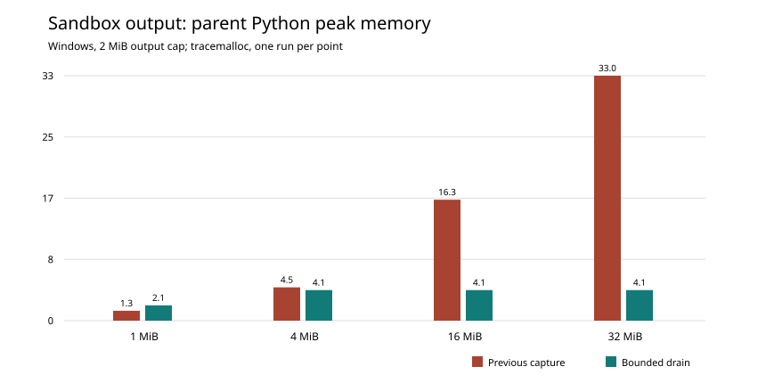

# MAYA benchmarks

## Sandbox output cap (Windows, 26 September 2026)

The sandbox previously used `subprocess.run(capture_output=True)` and checked its
2 MiB output cap only after the child exited. A child could therefore fill parent
memory with stdout or stderr while the parent waited for the wall-clock limit.
The new transport drains both pipes concurrently and stops the child when their
combined output crosses the cap.
The [Python subprocess documentation](https://docs.python.org/3.13/library/subprocess.html#subprocess.Popen.communicate)
warns that `communicate()` buffers output in memory; the
[Windows `select` documentation](https://docs.python.org/3.13/library/select.html)
explains why a pipe selector cannot serve as a portable replacement. Reader
threads drain the two pipes concurrently on all supported platforms.

On Windows 11 with Python 3.13.5, a child attempting 32 MiB of stdout caused
**33.042 MiB** peak parent Python allocations with the previous transport and
**4.119 MiB** with the bounded drain. The drain retained **2.000 MiB**. These
are single-run `tracemalloc` readings of the parent Python process; they do
not measure process RSS. Run `python tools/bench/bench_sandbox_output.py` to
repeat the measurement. The machine details and all eight readings are in
[`sandbox-output.json`](benchmarks/sandbox-output.json).



The regression tests in `tests/test_sandbox.py` also verify immediate termination
of still-running stdout and stderr writers, and that both streams share one cap.

---

Measured on 19 September 2026, against the success criteria (§3) and the capacity
and performance targets (§24.3) in the requirements. Every number here comes from
the result files in [`docs/benchmarks/`](benchmarks/). Each is the unedited JSON
printed by a tool in `tools/bench/`.

## Summary

| Criterion | Target | Result | Verdict |
|---|---|---|---|
| **SC-5**: p95 resolution, 50-column, 10-year daily feature set | under 15 s warm, under 60 s cold | no rules: warm p95 **0.98 s**, cold **1.0 s**. `forward_fill(limit=3)` on every attribute: warm p95 **6.1 s**, cold **6.3 s** | **pass** |
| Catalog search p95 over 100k objects | under 500 ms | p95 **0.16 s** (p50 0.08 s), 800,010 index rows | **pass** |
| **SC-4**: p95 page latency, metadata screens | under 300 ms | worst page p95 **0.15 s** (SQLite, one process); **0.18 s** (PostgreSQL, 8 web processes) | **pass** |
| §24.3 pin write throughput, one worker | 50 MB/s | **59.7 MB/s** (530.5 MB, 1.26M rows × 50 attributes, sealed in 8.9 s); a confirming run gave **51.4 MB/s** | **pass**, narrowly |
| §24.3 objects without degradation | 20k feature sets, 10k models, 100k pins | every page p95 under **30 ms** after seeding (worst: feature detail, 29 ms) | **pass** |
| §24.3 job queue throughput, one worker | 1,000 small jobs an hour | **134,962** an hour | **pass** |
| §24.3 cold start to serving | under 30 s | **1.26 s** to the first `200` from `/readyz` | **pass** |
| **SC-3**: 200 concurrent interactive users on one node without p95 degradation | p95 under 300 ms with 200 users | PostgreSQL, 8 web processes, with the principal cache, three runs: p95 **0.34 s**, **0.22 s**, **0.43 s** (median 0.34 s); 93–97 requests/s, no errors | **not met reliably**: one run of three passes; a dedicated host to settle it is out of scope by decision |

Which file holds which number:

| Result file | What it measured |
|---|---|
| [`sc5-sqlite-no-rules.json`](benchmarks/sc5-sqlite-no-rules.json) | SC-5 resolution, no resolution rules |
| [`sc5-sqlite-forward-fill.json`](benchmarks/sc5-sqlite-forward-fill.json) | SC-5 with `forward_fill(limit=3)` on every attribute |
| [`search-100k-sqlite.json`](benchmarks/search-100k-sqlite.json) | Catalog search over 100k objects |
| [`web-sqlite-1-process.json`](benchmarks/web-sqlite-1-process.json) | SC-4 page latency, SQLite, one process |
| [`web-postgresql-8-processes.json`](benchmarks/web-postgresql-8-processes.json) | SC-4 and SC-3, PostgreSQL, 8 web processes, before the principal cache |
| [`web-postgresql-8-processes-cache-run1.json`](benchmarks/web-postgresql-8-processes-cache-run1.json) … `-run2`, `-run3` | SC-3's three runs with the principal cache |
| [`capacity-sqlite.json`](benchmarks/capacity-sqlite.json) | The four §24.3 capacity targets |
| [`regression-baseline.json`](benchmarks/regression-baseline.json) | The baseline `tools/bench/regress.py` compares against (gate 26) |

## The machine

| | |
|---|---|
| CPU | AMD Ryzen AI 9 HX 370, 24 logical CPUs |
| Memory | 61 GB |
| OS | Linux 7.0.4 (x86-64), glibc 2.43 |
| Python | 3.13.15 |
| Databases | SQLite (WAL) on local disk; PostgreSQL 18 (embedded build) on the same machine |

This is a developer workstation, not a benchmark host. An IDE and other work ran
throughout; the load average ranged from 4 to over 50 during the runs. The server,
its database and the load generator all ran on this one machine.

## How to reproduce

```bash
# SC-5: 500 symbols × 10 years × 50 attributes = 1.26M rows
python tools/bench/bench_resolution.py
python tools/bench/bench_resolution.py --rule "forward_fill(limit=3)"

# catalog search over 100k objects
python tools/bench/bench_search.py --objects 100000

# §24.3: pin throughput, 20k sets / 10k models / 100k pins, job throughput, cold start
python tools/bench/bench_capacity.py

# SC-4 and SC-3: 2,000 features, 200 models, 200 users for 60 s
python tools/bench/bench_web.py                                  # SQLite, one process
MAYA_BENCH_PG_URL=postgresql+psycopg://maya@host:5432/maya \
  python tools/bench/bench_web.py --workers 8                    # PostgreSQL, 8 web processes
```

With `MAYA_BENCH_PG_URL` set, a tool creates and uses a fresh PostgreSQL database.
With `--workers` above 1, `bench_web.py` seeds the catalog, then starts the server as
production does (`run_maya_web.py --server.workers=N`) and measures it from outside.

## SC-5: resolution

The feature set is 500 symbols × 2,520 business days × 50 float attributes
(1,260,000 rows), ingested into the lake, resolved end to end: the lake read, the
resolution grid, the rules, and the output frame.

| Run | Cold | Warm p50 | Warm p95 |
|---|---|---|---|
| No rules | 1.01 s | 0.69 s | 0.98 s |
| `forward_fill(limit=3)` on all 50 attributes | 6.34 s | 6.01 s | 6.06 s |

The first run with forward fill took 63 s cold and 156 s warm: each rule ran once per
symbol per attribute (25,000 Python calls). The rules now run over whole columns at
once, grouped by symbol, in `maya/resolution/grouped.py`. On 96 randomised cases
(gaps, limits, ages, types) they give the same results as the per-group rules
(`tests/test_resolution_grouped.py`).

## Catalog search

100,000 features across 10 namespaces, each with a two-word name, description and
tags; 200 queries mixing prefixes, two-word queries and name fragments; the search a
signed-in user runs, including filtering to what they may read.

p50 0.082 s, p95 0.161 s, max 0.386 s; 42 hits on average.

## SC-4: page latency

One signed-in user requests each of eleven metadata screens 30 times after warming.
The screens are home, the feature list, a feature, the feature-set list, the model
list, a model, workflow, search, inbox, help and the workbench. The catalog holds
2,000 features and 200 models.

| Page | First run | SQLite, 1 process | PostgreSQL, 8 processes |
|---|---|---|---|
| Home | 1.27 s | 0.040 s | 0.076 s |
| Features list | 0.65 s | 0.154 s | 0.182 s |
| A feature | 0.021 s | 0.017 s | 0.061 s |
| Workbench | 2.26 s | 0.028 s | 0.071 s |
| Search | 0.042 s | 0.036 s | 0.029 s |
| Worst page | 2.26 s | **0.154 s** | **0.182 s** |

The first run failed. Every catalog list checked read access one row at a time, with
three queries per row, and looked up each row's latest version and pin count
separately: 6,000 queries for 2,000 features. The workbench fetched the whole catalog
to show the drafts, and the home page re-walked the entire audit log on every load.
All of these now happen in bulk, or once (see the commit history).

## SC-3: 200 concurrent users

Each of 200 users has their own session and browses random screens, with 1–3 s of
think time between requests, for 60 s. That offers about 90 requests per second.

| Configuration | Throughput | p50 | p95 | Max | Errors |
|---|---|---|---|---|---|
| First run: SQLite, 1 process | 3.4 req/s | 69 s | 74 s | 75 s | 0 |
| SQLite, 1 process, after the SC-4 fixes | 41 req/s | 2.6 s | 6.1 s | 8.2 s | 0 |
| **PostgreSQL, 8 web processes** | **94 req/s** | **0.06 s** | **0.37 s** | 1.6 s | 0 |

What it took:

- **Cheaper pages** (the SC-4 fixes).
- **Several web processes.** One Python process tops out near 40 page requests a
  second, and `server.workers` runs several on one port. The launching process keeps
  the job workers and the scheduler.
- **Even connection spread.** Behind one shared socket, a few processes took most
  of the long-lived connections; the busiest ran hot while others idled (p95 2.5 s).
  On Linux, each web process now binds its own `SO_REUSEPORT` socket, and the kernel
  spreads connections evenly.
- **PostgreSQL.** Several web processes over SQLite are refused. SQLite's unit of
  work holds a mutex inside one process, and across processes that guarantee does
  not hold.

**With the principal cache.** A signed-in session's principal is now reused for two
seconds (`auth.session.principal_cache_seconds`). Before, the home page resolved it
six times. Three further full runs on the same configuration:

| Run | Throughput | p50 | p95 | Max | Errors | p95 ÷ single-user p95 |
|---|---|---|---|---|---|---|
| 1 | 95.3 req/s | 0.056 s | 0.345 s | 1.73 s | 0 | 1.97 |
| 2 | 96.6 req/s | 0.033 s | **0.215 s** | 0.80 s | 0 | 1.22 |
| 3 | 93.4 req/s | 0.054 s | 0.425 s | 3.37 s | 0 | 2.16 |

One run of three meets the target; the median p95 (0.34 s) does not. The
configuration was identical across the runs, so the spread is most likely the
machine rather than the code — but that is an inference, and only a quiet, dedicated
host could turn it into a measurement. A dedicated benchmark host is out of scope by
the owner's decision, so SC-3 stands as **not met reliably** on this workstation, and
this report does not claim it.

**Why the first run failed.** The p95 of 0.37 s is above 0.3 s, and it is twice the
single-user p95, so it counts as degradation. Tail latency varied about twofold from
run to run on this shared machine: the same configuration measured p95 0.33 s, 0.37 s
and 0.67 s. The remaining per-request costs are known:

- The home page resolved the signed-in user once per internal API call, six times (now cached, above).
- The feature-list total counts readable rows by walking the list.

## Caveats

- **One machine, not the specified topology.** §24.3 states its targets for a
  clustered deployment: 200 users per API pod of 4 vCPU and 8 GB. Here 8 web
  processes on a 24-CPU workstation served the 200 users, and the database and load
  generator shared the machine, which was also running an IDE. The per-pod figure
  has not been measured.
- **SQLite for SC-5 and search.** Neither has been measured on PostgreSQL.
- **SC-3 on PostgreSQL only.** SQLite, which admits one writing process, serves
  SC-3's load from one process (41 req/s above).
- **Tail latencies here vary about twofold between runs.** Treat single-run p95
  figures near a target as indicative, not conclusive.
- **No dedicated benchmark host, by decision.** Every number here comes from the
  shared workstation above and will not be re-measured elsewhere. A verdict close to
  its target (SC-3 above all) is therefore a verdict about this machine.

## Capacity (§24.3)

From [`capacity-sqlite.json`](benchmarks/capacity-sqlite.json), one run of
`tools/bench/bench_capacity.py` on SQLite, load average about 5.

| Measure | Target | Result |
|---|---|---|
| Pin write throughput: one job pins a 500-symbol, 10-year, 50-attribute daily feature — fragmenting, hashing every row, writing, and re-reading to verify | 50 MB/s per worker | 530.5 logical MB in 8.89 s: **59.7 MB/s**. A second run: 10.32 s, **51.4 MB/s** |
| Job throughput: 200 pins of a ten-row feature, one worker draining the queue | 1,000 an hour | 5.33 s: **134,962 an hour** |
| Objects without degradation: catalog pages p95, empty and after seeding 20,000 feature sets, 10,000 models and 100,000 pins | no degradation | features 2.1 → 12.8 ms, feature sets 1.0 → 8.1 ms, models 1.1 → 5.5 ms, a feature's detail page 5.5 → 29.2 ms |
| Cold start: `run_maya_web.py` on the seeded storage to its first `200` from `/readyz` | under 30 s | **1.26 s** |

How pin throughput got there, measured on the same pin: 6.4 MB/s when first run. Then:

- Canonical row hashing done a column at a time, and a pin reassembled by one sort: 28.1 MB/s.
- Sealing that compares values with what was hashed instead of hashing twice, and vectorised logical-type conversion: 37.9 MB/s.
- The pin's 2,349 fragment files read in parallel, and rows of one layout hashed from contiguous slabs: 51–60 MB/s.

Each replacement is tested equal to the code it replaced (`tests/test_canonical_fast.py`, `tests/test_shapes_arrow.py`). What remains is the per-row sha256 loop, the Delta write and the read-back, in roughly equal parts.

"No degradation" is read as every page staying well inside SC-4's 300 ms. The pages do
slow as the catalog grows, five to eight times from an empty catalog, but from
milliseconds to tens of milliseconds. Two fixes made that true: a feature's page shows
its latest 100 pins and pages the rest, where it had loaded all 100,000 (4.3 s); and a
list's total under row-level authorization is counted in the database by namespace and
ownership, where it had tested every row (0.15 s for feature sets).

## Not yet measured

- Delta table size per feature (2 TB).
- The per-pod figures of §24.3 on the specified topology.
- Any §24.3 figure on PostgreSQL.

The availability and recovery objectives (§24) have not been measured. The restore
drill has been performed and timed, but on a small estate
([runbook](runbooks/restore-drill.md#5-record-the-result)), which says the procedure
works, not what a real recovery takes.
